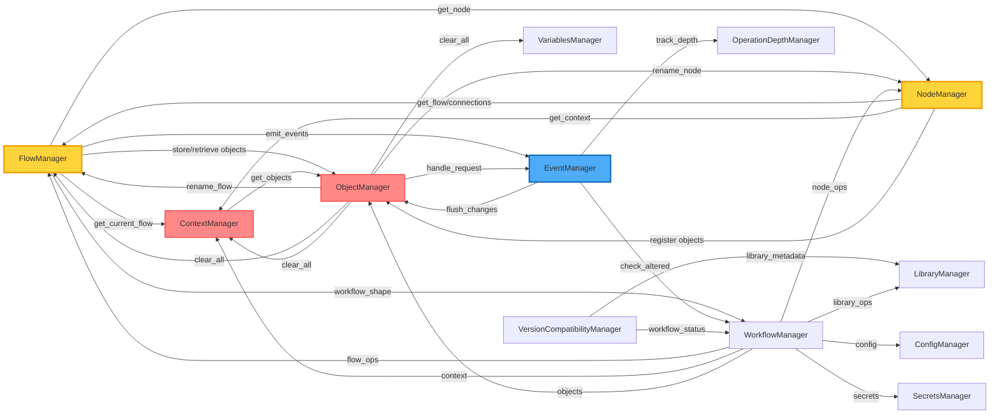
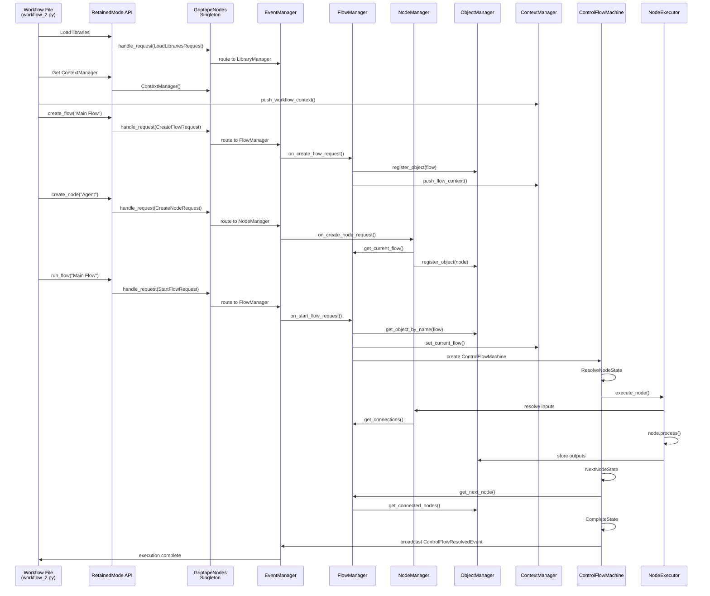
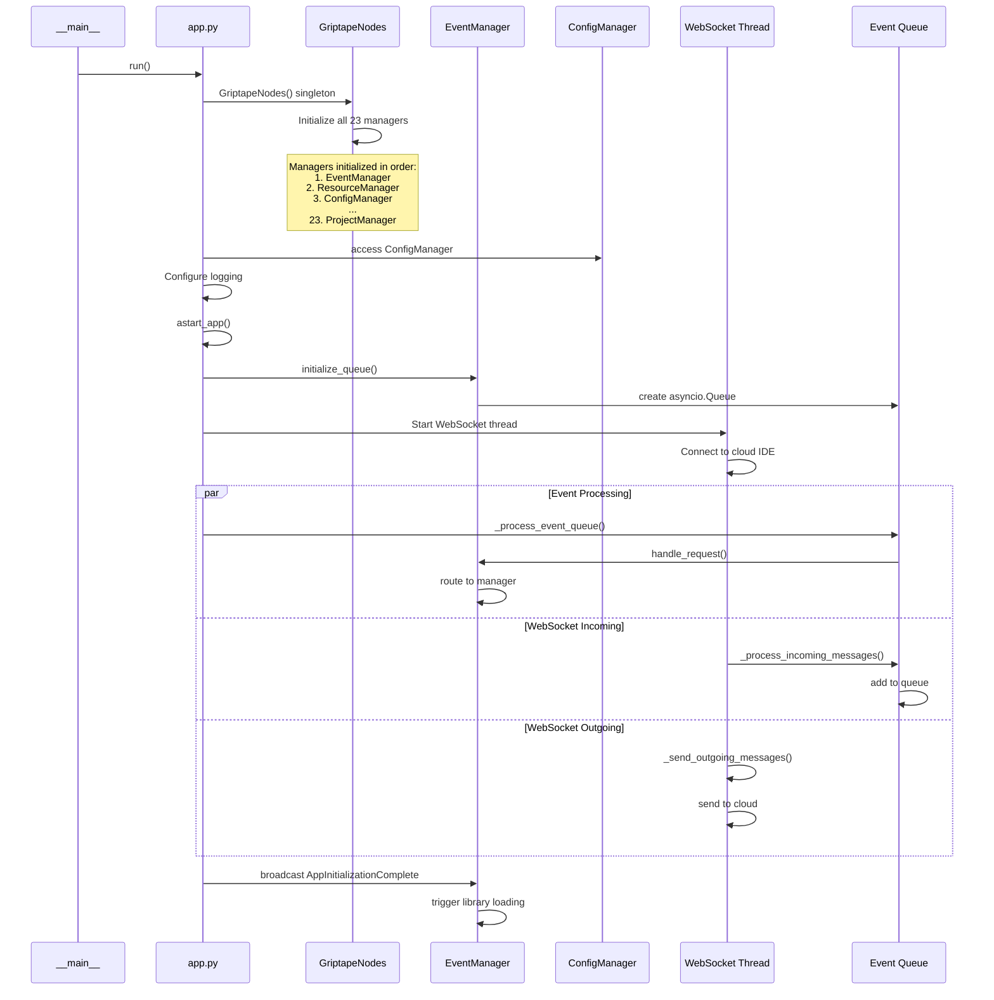
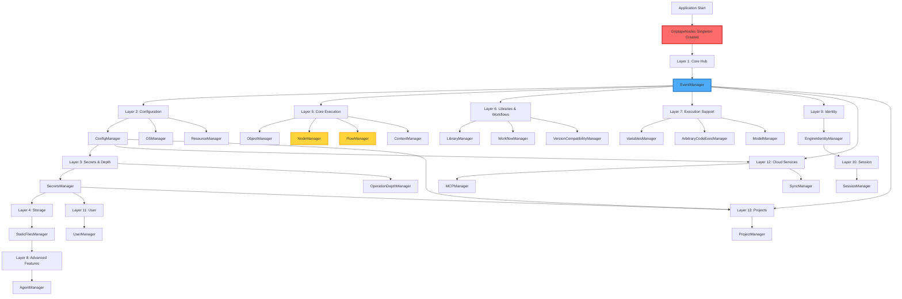

# Griptape Nodes Architecture Diagram

## Manager Dependency Architecture

```mermaid
graph TB
    %% Application Layer
    App[FastAPI App<br/>app.py]
    WS[WebSocket Manager<br/>NodesApiSocketManager]

    %% Singleton Container
    GN[GriptapeNodes Singleton<br/>griptape_nodes.py]

    %% Core Hub
    EM[EventManager<br/>No Dependencies]

    %% Configuration Layer
    CM[ConfigManager<br/>→ EventManager]
    SM[SecretsManager<br/>→ ConfigManager<br/>→ EventManager]
    OPM[OperationDepthManager<br/>→ ConfigManager]

    %% Storage & Files Layer
    SFM[StaticFilesManager<br/>→ ConfigManager<br/>→ SecretsManager<br/>→ EventManager]

    %% Core Execution Managers
    OM[ObjectManager<br/>→ EventManager]
    NM[NodeManager<br/>→ EventManager]
    FM[FlowManager<br/>→ EventManager]
    CTX[ContextManager<br/>→ EventManager]

    %% Library & Workflow Layer
    LM[LibraryManager<br/>→ EventManager]
    WFM[WorkflowManager<br/>→ EventManager]
    VCM[VersionCompatibilityManager<br/>→ EventManager]

    %% Execution Support
    VM[VariablesManager<br/>→ EventManager]
    ACM[ArbitraryCodeExecManager<br/>→ EventManager]
    MM[ModelManager<br/>→ EventManager]
    AGM[AgentManager<br/>→ StaticFilesManager<br/>→ EventManager]

    %% Infrastructure
    OSM[OSManager<br/>→ EventManager]
    RM[ResourceManager<br/>→ EventManager]

    %% Identity & Session
    EIM[EngineIdentityManager<br/>→ EventManager]
    SSM[SessionManager<br/>→ EngineIdentityManager<br/>→ EventManager]
    UM[UserManager<br/>→ SecretsManager]

    %% Cloud & Sync
    MCPM[MCPManager<br/>→ EventManager<br/>→ ConfigManager]
    SYM[SyncManager<br/>→ EventManager<br/>→ ConfigManager]
    PM[ProjectManager<br/>→ EventManager<br/>→ ConfigManager<br/>→ SecretsManager]

    %% Application connections
    App --> GN
    App --> WS
    WS --> EM

    %% Singleton contains all managers
    GN -.contains.-> EM
    GN -.contains.-> CM
    GN -.contains.-> SM
    GN -.contains.-> OPM
    GN -.contains.-> SFM
    GN -.contains.-> OM
    GN -.contains.-> NM
    GN -.contains.-> FM
    GN -.contains.-> CTX
    GN -.contains.-> LM
    GN -.contains.-> WFM
    GN -.contains.-> VCM
    GN -.contains.-> VM
    GN -.contains.-> ACM
    GN -.contains.-> MM
    GN -.contains.-> AGM
    GN -.contains.-> OSM
    GN -.contains.-> RM
    GN -.contains.-> EIM
    GN -.contains.-> SSM
    GN -.contains.-> UM
    GN -.contains.-> MCPM
    GN -.contains.-> SYM
    GN -.contains.-> PM

    %% Constructor dependencies (solid lines)
    CM --> EM
    SM --> CM
    SM --> EM
    OPM --> CM
    SFM --> CM
    SFM --> SM
    SFM --> EM
    AGM --> SFM
    AGM --> EM
    SSM --> EIM
    SSM --> EM
    UM --> SM
    MCPM --> EM
    MCPM --> CM
    SYM --> EM
    SYM --> CM
    PM --> EM
    PM --> CM
    PM --> SM

    %% All basic managers depend on EventManager
    OM --> EM
    NM --> EM
    FM --> EM
    CTX --> EM
    LM --> EM
    WFM --> EM
    VCM --> EM
    VM --> EM
    ACM --> EM
    MM --> EM
    OSM --> EM
    RM --> EM
    EIM --> EM

    style GN fill:#ff6b6b,stroke:#c92a2a,stroke-width:3px
    style EM fill:#4dabf7,stroke:#1971c2,stroke-width:3px
    style App fill:#51cf66,stroke:#2f9e44,stroke-width:2px
    style FM fill:#ffd43b,stroke:#f59f00,stroke-width:2px
    style NM fill:#ffd43b,stroke:#f59f00,stroke-width:2px
    style WFM fill:#ffd43b,stroke:#f59f00,stroke-width:2px
```

## Runtime Manager Interaction Graph

This shows how managers call each other during workflow execution (not constructor dependencies):

## Workflow Execution Flow

## Application Startup Sequence

## Manager Initialization Order

## Key Architectural Patterns

### 1. Singleton Container Pattern
- **GriptapeNodes** contains all managers as singleton instances
- Lazy initialization on first access
- Global state shared across entire application

### 2. Event-Driven Hub-and-Spoke
- **EventManager** at the center
- All operations flow through request/response events
- Managers register handlers for specific event types

### 3. Context Hierarchy
- **ContextManager** maintains: Workflow → Flow → Node → Element
- Provides scope for operations
- Tracks current execution context

### 4. Object Registry Pattern
- **ObjectManager** maintains name-to-object mapping
- All flows, nodes, and parameters registered globally
- Name collisions prevented by registry

### 5. State Machine Execution
- **ControlFlowMachine** orchestrates execution
- States: ResolveNodeState → NextNodeState → CompleteState
- Isolated or global DAG builder based on context

## Critical Coupling Points

### Tightly Coupled (Prevents Isolation)
1. **GriptapeNodes Singleton** - Only one instance globally
2. **FlowManager Global State** - Single control flow machine, queue, DAG
3. **ObjectManager Global Registry** - All objects in one namespace
4. **Cross-Manager Singleton Access** - `GriptapeNodes.ManagerName()` everywhere

### Loosely Coupled (Enables Flexibility)
1. **Library System** - Plugin architecture
2. **Storage Backends** - Strategy pattern
3. **Event Handlers** - Registration-based routing
4. **Node Types** - Inheritance with minimal interface

## Files Referenced

### Core Files
- [griptape_nodes.py](src/griptape_nodes/retained_mode/griptape_nodes.py) - Singleton container
- [app.py](src/griptape_nodes/app/app.py) - Application entry point
- [event_manager.py](src/griptape_nodes/retained_mode/managers/event_manager.py) - Event routing hub

### Execution Files
- [flow_manager.py](src/griptape_nodes/retained_mode/managers/flow_manager.py) - Flow lifecycle
- [node_manager.py](src/griptape_nodes/retained_mode/managers/node_manager.py) - Node operations
- [control_flow.py](src/griptape_nodes/machines/control_flow.py) - State machine
- [node_executor.py](src/griptape_nodes/common/node_executor.py) - Node execution

### Support Files
- [object_manager.py](src/griptape_nodes/retained_mode/managers/object_manager.py) - Object registry
- [context_manager.py](src/griptape_nodes/retained_mode/managers/context_manager.py) - Context stack
- [workflow_manager.py](src/griptape_nodes/retained_mode/managers/workflow_manager.py) - Workflow persistence
- [library_registry.py](src/griptape_nodes/node_library/library_registry.py) - Library management

### Example Workflow
- [workflow_2.py](GriptapeNodes/workflow_2.py) - Example workflow file
