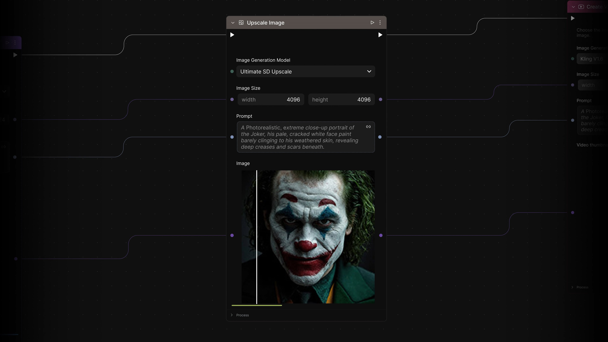

<picture>
  <source media="(prefers-color-scheme: dark)" srcset="docs/assets/img/griptape_nodes_from_foundry_white.svg">
  
</picture>

Griptape Nodes is a powerful, visual, node-based workflow builder designed for professional artists and creators. Build and execute complex AI workflows through the cloud-based [Griptape Nodes IDE](https://app.nodes.griptape.ai/) - an intuitive drag-and-drop interface.

This repository contains the Griptape Nodes Engine - the local component that runs securely on your machine, providing a performant foundation for workflow execution.

[](https://vimeo.com/1064451891)
*(Clicking the image opens the video on Vimeo)*

**✨ Key Features:**

- **🎯 Visual Workflow Editor:** Design and connect nodes representing different AI tasks, tools, and logic through the cloud-based IDE
- **🏠 Local Engine:** Run workflows securely on your own machine or infrastructure
- **🐍 Portable Python Workflows:** Workflows are saved as self-executable Python files for portability, debugability, and learning
- **🌐 Multi-Device Access:** Client/server architecture lets you access your workflows from any device
- **🧩 Extensible:** Build your own custom nodes and libraries to extend functionality
- **⚡ Scriptable Interface:** Interact with and control flows programmatically

**🔗 Learn More:**

- **📚 Full Documentation:** [docs.griptapenodes.com](https://docs.griptapenodes.com)
- **⚙️ Installation:** [docs.griptapenodes.com/en/stable/installation/](https://docs.griptapenodes.com/en/latest/installation/)
- **🔧 Engine Configuration:** [docs.griptapenodes.com/en/stable/configuration/](https://docs.griptapenodes.com/en/latest/configuration/)
- **📋 Migration Guide:** [MIGRATION.md](MIGRATION.md) - Guide for migrating from deprecated nodes

**🧩 Extending Griptape Nodes:**

Want to create custom nodes for your specific workflow needs? Griptape Nodes is designed to be extensible through custom libraries:

- **📦 Custom Library Template:** Get started with the [Griptape Nodes Library Template](https://github.com/griptape-ai/griptape-nodes-library-template)
- **🛠️ Build Custom Nodes:** Create specialized nodes tailored to your artistic and creative workflows

______________________________________________________________________

## 🚀 Quick Installation

### Option 1: Griptape Nodes Desktop (Recommended)

Download [Griptape Nodes Desktop](https://www.griptapenodes.com/griptape-nodes-desktop) — a bundled app that includes both the engine and the editor. No additional setup required.

### Option 2: Manual Engine Install

For users who prefer to install the engine directly:

1. **🔐 Login:** Visit [Griptape Nodes](https://app.nodes.griptape.ai/) and log in or sign up using your Griptape Cloud credentials.

1. **💾 Install Engine:** Install the engine using [uv](https://docs.astral.sh/uv/):

    ```bash
    uv tool install griptape-nodes
    ```

1. **⚙️ Initial Configuration (Automatic on First Run):**

    - The first time you run the engine command (`griptape-nodes` or `gtn`), it will guide you through the initial setup:
    - **📁 Workspace Directory:** You'll be prompted to choose a directory where Griptape Nodes will store configurations, project files, secrets (`.env`), and generated assets. You can accept the default (`<current_directory>/GriptapeNodes`) or specify a custom path.
    - **🔑 Griptape Cloud API Key:** Return to the [Griptape Nodes setup page](https://app.nodes.griptape.ai/) in your browser, click "Generate API Key", copy the key, and paste it when prompted in the terminal.

1. **🚀 Start the Engine:** After configuration, start the engine by running:

    ```bash
    griptape-nodes
    ```

    *(or the shorter alias `gtn`)*

1. **🔗 Connect Workflow Editor:** Refresh the Griptape Nodes Workflow Editor page in your browser. It should now connect to your running engine.

You're now ready to start building flows! 🎉 For more detailed setup options and troubleshooting, see the full [Documentation](https://docs.griptapenodes.com/).
