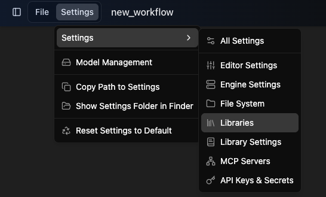
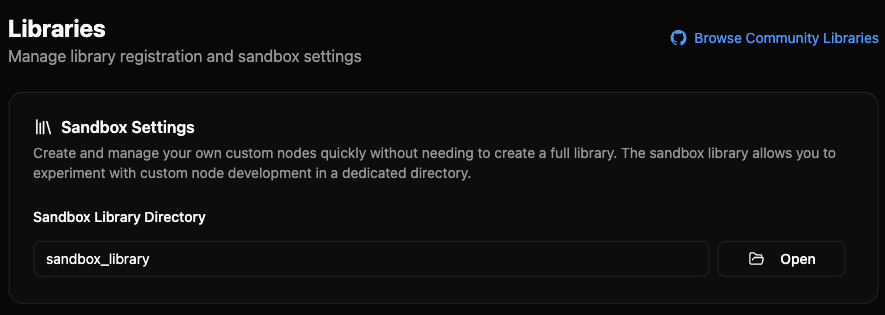
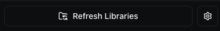
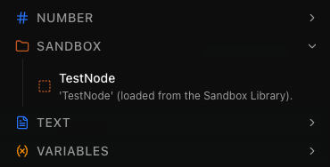
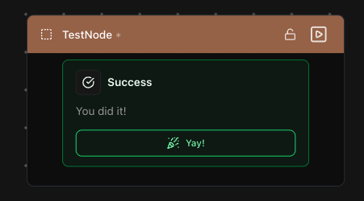

# Setup

Normally, custom nodes will live inside a **node library**.\
A library provides structure, versioning, distribution, and a clean way to share nodes with others.

But when you’re just starting out—or experimenting with new ideas—you don’t need that overhead.\
To make iteration fast, Griptape Nodes includes the abililty to use a **Sandbox**: a folder that’s automatically watched for Python files containing node definitions.

Any valid node you save here is:

- Discovered automatically
- Added to the **Sandbox** section in the node list
- Instantly available in the editor without registering a full library
- You can add, remove, or edit nodes in this folder at any time

This makes it ideal for:

- Prototyping new nodes quickly
- Learning how node authoring works
- Iterating without worrying about packaging or structure

______________________________________________________________________

## Creating or opening your sandbox

Sandbox folders **don’t exist by default**.\
You’ll need to create one before you can add any nodes to it.

The sandbox will be created inside the location you’ve already set as your workspace.

1. **Open Griptape Nodes.**

1. Go to the **Navigation Bar → Settings → Libraries**.

    

1. Under **Sandbox Settings**, type a name for your sandbox directory.

    - We recommend `sandbox_library`.
    - You can name it anything you want.

    

1. If the folder doesn’t exist yet, click **Create**.

    - Hovering over “Create” will show the full folder path that will be created.

1. If it already exists, click **Open** to reveal it in Finder or Explorer.

!!! tip

    Once created, this folder will be automatically watched by Griptape Nodes.\
    Any valid node placed here is discoverable and will appear under the **Sandbox** section in the node list once you reload Libraries.

______________________________________________________________________

## Verifying your sandbox

Once your sandbox is created, you can confirm it’s working by adding a simple test node.\
This ensures Griptape Nodes can discover and load Python files from your sandbox.

1. **Click “Open”** in the Sandbox settings to open the folder in Finder or Explorer.

1. Create a new file in this folder with your preferred editor (e.g. VS Code).

1. Name the file: `test_node.py`

1. Copy and paste the following Python code into the file and save it:

    ```python
    from griptape_nodes.exe_types.core_types import ParameterMessage
    from griptape_nodes.exe_types.node_types import BaseNode

    class TestNode(BaseNode):
        def __init__(self, **kwargs) -> None:
            super().__init__(**kwargs)

            self.add_node_element(
                ParameterMessage(
                    variant="success",
                    value="You did it!",
                    title="Success",
                    button_text="Yay!",
                    button_icon="party-popper",
                    button_link="#confetti",
                )
            )

        def process(self) -> None:
            pass
    ```

    !!! note

        Don't worry about what the contents of the file are - we'll cover all the elements in a future lesson.

1. In the Griptape Nodes sidebar, click Refresh Libraries.

    - If prompted, click Refresh again.

    

1. The Sandbox folder should now appear in the node list, and you should see TestNode.

    

1. Drag TestNode into the workflow editor.

    

1. Resize the node if needed to see the success message.

1. Click the “Yay!” button to celebrate with some confetti. 🎉

## Troubleshooting

If the node doesn’t appear:

- Make sure the file is saved directly inside the sandbox folder (not a subfolder).
- Check the file name and class name.
- Refresh the libraries or restart the app.

______________________________________________________________________

## Next steps

You now have a working sandbox and have successfully loaded your first test node.\
From here, you can start adding your own Python files to the sandbox.\
Each new file containing a valid node class will automatically show up in the Sandbox section of the node list after a refresh.

Next, you’ll create your first custom node from scratch.

[← Previous: Overview](overview.md) | [Next: Hello Node →](hello-node.md)
