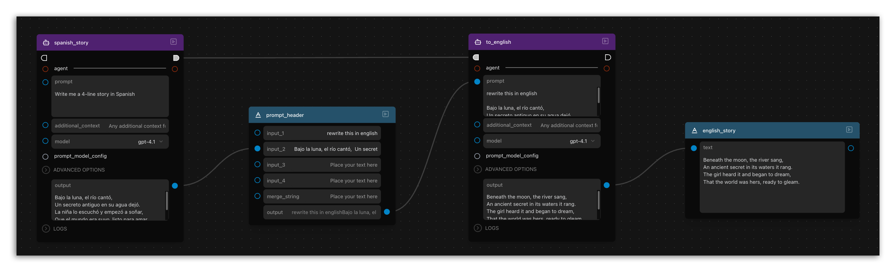
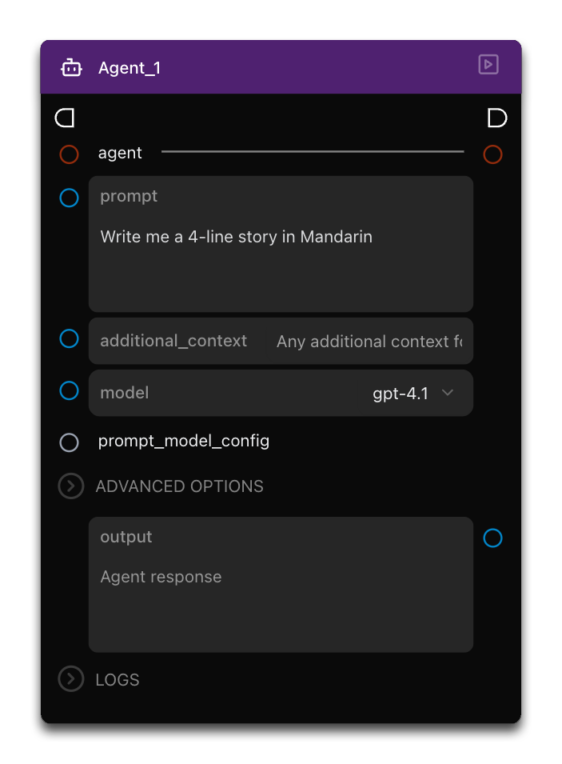
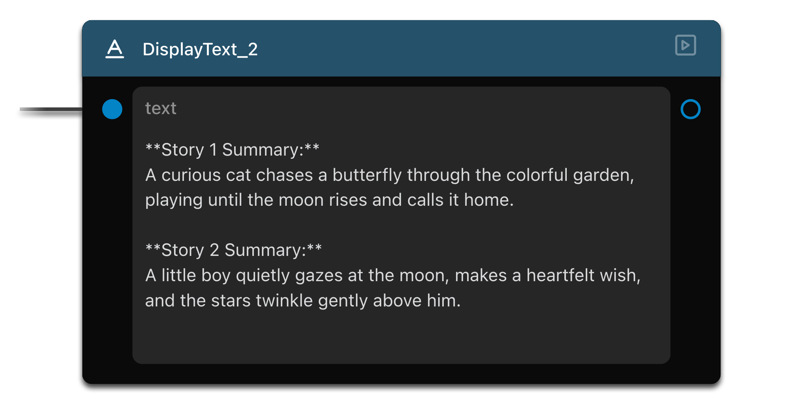

# Coordinating Agents

Welcome to the third tutorial in our Griptape Nodes series! In this guide, you'll learn how to coordinate multiple agents within a workflow to perform sequential tasks—specifically, translating stories between languages and summarizing them.

## What You'll Learn

In this tutorial, you will:

- Connect multiple Agent nodes in a workflow
- Create a translation workflow between languages
- Understand execution chains for controlling workflow order
- Expand your workflow to summarize content

## Navigate to the Landing Page

To begin this tutorial, go to the landing page. Locate and open the example workflow called "Translator" at the top of the page.

## Explore the Example Workflow

When the example loads, you'll see a workflow with the following components:

- **Agent Node (spanish_story)**: Generates a four-line story in Spanish
- **Merge Text Node**: Combines the Spanish story with "Rewrite this in English"
- **Second Agent Node (to_english)**: Translates the merged prompt into English
- **Display Text Node**: Shows the final English translation

When run, this workflow demonstrates how multiple agents can each have their own distinct "jobs". By connecting the output of one agent, then transforming that output for use by another, you can start to get an inkling of some of the complexity you'll be able to control. The final result of "write a 4-line story in Spanish" and then rewriting that into English, we can see the following result:

!!! info

    You should expect variability in these from run-to-run. That's okay - even normal! Remember, talking with an Agent can in a way be like talking to a person. You may get slightly different answers if you ask them the same question many times!

## Build Your Own Version

Now let's build a similar workflow from scratch:

1. Drag two agent nodes onto the canvas
1. Add a merge text node
1. Add a display text node

## Configure the First Agent

Set up your first agent to generate content in your chosen language:

1. In the first agent node, enter: `Write me a four line story in [your chosen language]` (e.g., Mandarin, French, etc.)
1. This agent will generate the initial story that we'll translate

## Connect to the Merge Text Node

Next, prepare the translation prompt:

1. Connect the output from the first agent to the merge text node
1. Set the merge text node to combine: `Rewrite this in English` with the output from the first agent
1. This creates the instruction for our translator agent

## Configure the Second Agent

Set up the translator agent:

1. Connect the output of the merge text node to the second agent node
1. This agent will receive both the original story and the instruction to translate it
1. It will produce an English translation as output

## Display the Result

To see the final translation:

1. Connect the output of the second agent to the display text node
1. When the workflow runs, this node will show the translated English text

## Understand Execution Order (Exec Chain)

A key concept in Griptape Nodes is the execution chain:

1. Notice the "exec in" and "exec out" pins (half-circle connectors) on nodes
1. These define the order in which nodes run
1. For complex workflows, connect the last pin of one section to the first pin of the next
1. This ensures nodes run in the correct sequence, even with complex data flows

## Expand the Workflow: Summarize Multiple Stories

Let's enhance our workflow to handle summarization:

1. Add a new merge text node that combines both English translations
1. In this merge text node, enter: `Summarize both these stories` as the first entry
1. Connect both the to-english nodes' outputs into slots 2&3 on the merge texts node
1. Add another agent node to process the summary prompt
1. Connect the merge text output into the prompt for your new agent
1. Connect the agent output to a new display text node
1. Use exec chain pins to ensure this summary step runs last (even connect everything up to run in the order you want!)

## Run the Complete Workflow

Execute your expanded workflow and observe the process:

1. The first agents generate stories in different languages
1. The merge text nodes create prompts to translate them
1. The second agents translate the stories into English
1. The summary agent combines and summarizes both translations
1. The display nodes show all the results

## Summary

In this tutorial, you learned how to:

- Build a translation workflow with multiple agents
- Use merge text nodes to prepare inputs for agents
- Control execution order with exec chains
- Expand workflows to process and summarize multiple inputs

## Next Up

In the next section: [Compare Prompts](../03_compare_prompts/FTUE_03_compare_prompts.md), we'll learn how to get AIs to bucket-brigade through flows!
