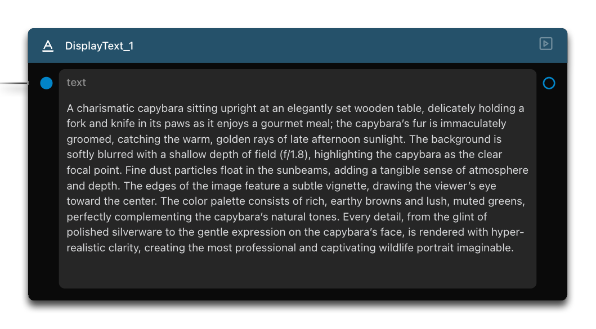

# Advanced Prompt Techniques for Image Generation

Welcome to the third tutorial in our Griptape Nodes series! This guide explores how different prompting methods can significantly enhance your AI-generated images.

## What You'll Learn

In this tutorial, you will:

- Compare different prompting techniques
- Understand the "Enhance Prompt" feature
- Create custom prompt enhancement flows
- See how agent nodes can transform basic prompts into detailed instructions

## Navigate to the Landing Page

To begin this tutorial, return to the main landing page by clicking on the navigation element at the top of the interface.

## Open the Compare Prompts Example

On the landing page, locate and click on the **"Compare Prompts"** tile to open this example scene.

## Understand the Workflow Structure

When the example loads, you'll see a more complex setup than in previous tutorials:

This workflow contains:
- Three image generation nodes
- An agent node
- Text input and merge nodes
- Connections between these components

We'll use the same base prompt ("a capybara eating with utensils") across different setups to demonstrate how prompting techniques affect the final image.

## Compare Different Prompting Methods

### Method 1: Basic Prompt

The first method uses a direct, unmodified prompt:

1. Locate the first image generation node
2. Notice that it uses the basic prompt without any enhancements
3. Run this node by clicking its individual run button

Observe the resulting image. This represents how the AI interprets your straightforward description.

### Method 2: Enhanced Prompt Feature

The second method uses Griptape's built-in prompt enhancement:

1. Find the second image generation node
2. Notice that the "Enhance Prompt" feature is enabled
3. Run this node

Compare this result with the first image. You should see a more dynamic and visually interesting interpretation of the same basic idea.

### Method 3: Custom Agent-Enhanced Prompt

The third method demonstrates a more advanced approach using an agent to customize the prompt:

1. Examine the flow that includes:
   - A text input node with your base prompt
   - A "Merge Texts" node that combines the base prompt with specific enhancement instructions
   - An agent node that processes these instructions

2. Run the agent node
3. Review the output text, which should be a significantly expanded and detailed version of your original prompt

4. Finally, run the third image generation node, which uses this agent-enhanced prompt with the "Enhance Prompt" feature turned off

Notice how this image contains more specific details, artistic elements, and narrative qualities compared to the previous methods.

## Understanding the Differences

Let's analyze what we've learned:

- **Basic Prompt**: Provides a straightforward interpretation with minimal detail
- **Enhanced Prompt Feature**: Automatically improves your prompt with general enhancements
- **Custom Agent Enhancement**: Allows for specific, targeted improvements based on your instructions

The key insight is that while the "Enhance Prompt" feature provides a convenient way to improve your results, creating custom instructions through an agent gives you greater creative control and more specific outcomes.

## Applications and Best Practices

Consider these approaches for your own projects:

- Use basic prompts for quick, simple image generation
- Enable "Enhance Prompt" when you want general improvements with minimal effort
- Create custom agent-based enhancement flows when you need precise control over specific artistic elements, style, composition, or narrative qualities

## Next Steps

Now that you understand these advanced prompting techniques, you're ready to apply them in your own creative workflows. In the next tutorial, we'll explore how to combine these concepts with other Griptape Nodes features.

## Summary

In this tutorial, you learned how to:
- Compare three different prompting methods
- Use the built-in "Enhance Prompt" feature
- Design custom prompt enhancement flows with agent nodes
- Analyze how different prompting techniques affect image generation results

These techniques form the foundation for creating sophisticated, high-quality AI-generated imagery using Griptape Nodes.

## Next Up

In the next section: [Build a Photography Team](../04_photography_team/FTUE_04_photography_team.md), we'll learn about a lot: Rulesets, Tools, and Converting Agents INTO tools to get an idea of some of the sophistacated coordination available to you!