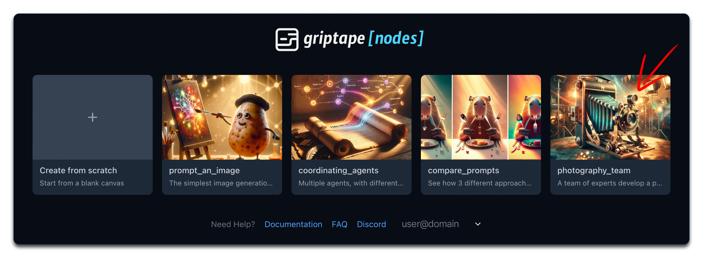

# Build a Photography Team

Welcome to the fifth tutorial in our Griptape Nodes series! In this guide, you'll learn how to create a sophisticated system of coordinated agents that work together like a photography team to generate spectacular image prompts.

## What You'll Learn

In this tutorial, you will:

- Understand and implement rule sets for specialized agents
- Convert agents into reusable tools
- Create a team of specialized AI experts
- Coordinate multiple agents through execution chains
- Generate high-quality image prompts through team collaboration

## Navigate to the Landing Page

To begin this tutorial, return to the main landing page by clicking on the navigation element at the top of the interface.

## Open the Photography Team Example

On the landing page, locate and click on the **"Photography Team"** tile to open this example scene.

## Understanding Rule Sets

Rule sets are a powerful feature that guide how agents perform their tasks:

1. Locate the cinematographer agent in the workflow
2. Open its configuration panel
3. Notice the rule set that defines its behavior - it focuses on framing, subject identification, and evoking emotional connections

Each rule set contains specific instructions that help the agent specialize in a particular domain, making it an expert in its field.

## Implementing Rule Set Lists

For better organization, rule sets are typically implemented as lists:

1. Find the rule set list attached to the cinematographer agent
2. Notice how multiple rules are organized within a single list
3. This structure makes it easier to manage complex agent behaviors

## Introducing Tools

Tools allow agents to access specialized functionality:

1. Examine the workflow to find tools derived from specialized agents
2. Notice how agents can be converted into tools for use by other agents
3. This creates a hierarchical structure where expert agents become resources

## Converting an Agent into a Tool

Let's understand how to transform an expert agent into a reusable tool:

1. Locate the color theorist agent in the workflow
2. Notice the configuration that converts it into a tool
3. See how the tool is assigned a descriptive prompt that explains its purpose
4. Observe how the tool is added to a tool list that can be assigned to other agents

## Creating Specialized Agents

The photography team consists of several specialized agents:

1. **Cinematographer**: Focuses on framing, composition, and visual storytelling
2. **Color Theorist**: Specializes in color harmonies, palettes, and emotional impact of colors
3. **Detail Enthusiast**: Concentrates on intricate details that enhance visual interest
4. **Image Generation Specialist**: Formats prompts optimally for the AI image generator

Each agent has specific rule sets that make them experts in their respective domains.

## Coordinating Agents and Tools

The key to this workflow is coordination:

1. Find the central agent that orchestrates the entire process
2. Notice how all specialized tools are assigned to this agent
3. Observe the execution chain that defines the order of operations
4. See how the final output feeds into the generate image node

## Executing the Process

Let's run the workflow to see the coordinated team in action:

1. Enter a simple prompt like "teddy bear" in the input node
2. Run the workflow by clicking the run button
3. Watch as each specialized agent contributes its expertise
4. Review the final prompt created by the team
5. Examine the generated image that results from this collaborative effort

## Customizing Your Photography Team

Try personalizing the system:

1. Modify the rule sets to create differently specialized agents
2. Add new tools with unique expertise
3. Change the input prompt to generate different types of images
4. Experiment with the execution order to see how it affects the output

## Next Steps

Now that you understand how to create coordinated systems of specialized agents, you're ready to build your own sophisticated workflows. You can apply these concepts to various domains beyond image generation.

## Summary

In this tutorial, you learned how to:
- Understand and implement rule sets for specialized agents
- Convert agents into reusable tools
- Create a team of specialized AI experts
- Coordinate multiple agents through execution chains
- Generate high-quality image prompts through team collaboration

These advanced techniques showcase the full power of Griptape Nodes for creating complex, collaborative AI systems.

## Next Up

This concludes our tutorial series on Griptape Nodes! You now have a solid foundation in creating sophisticated workflows with agents, tools, rule sets, and coordinated systems. From here, you can continue exploring and building your own custom applications!