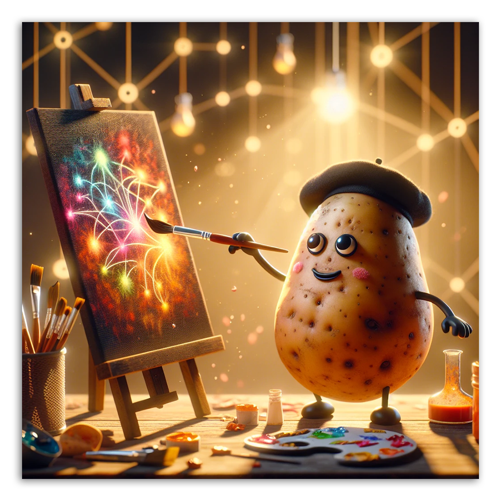
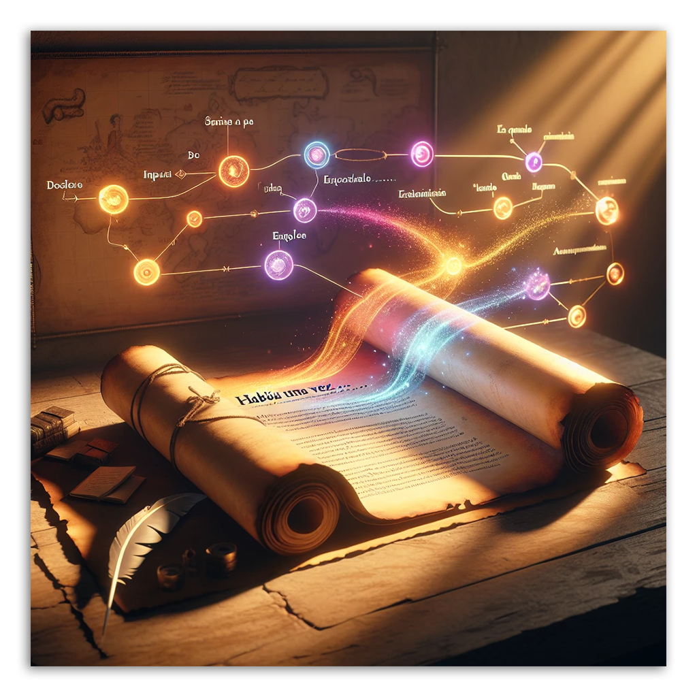
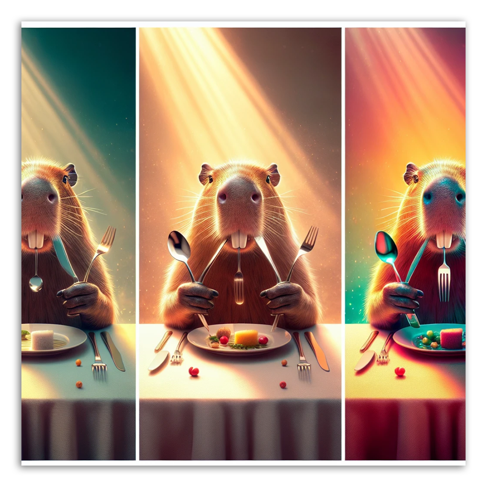
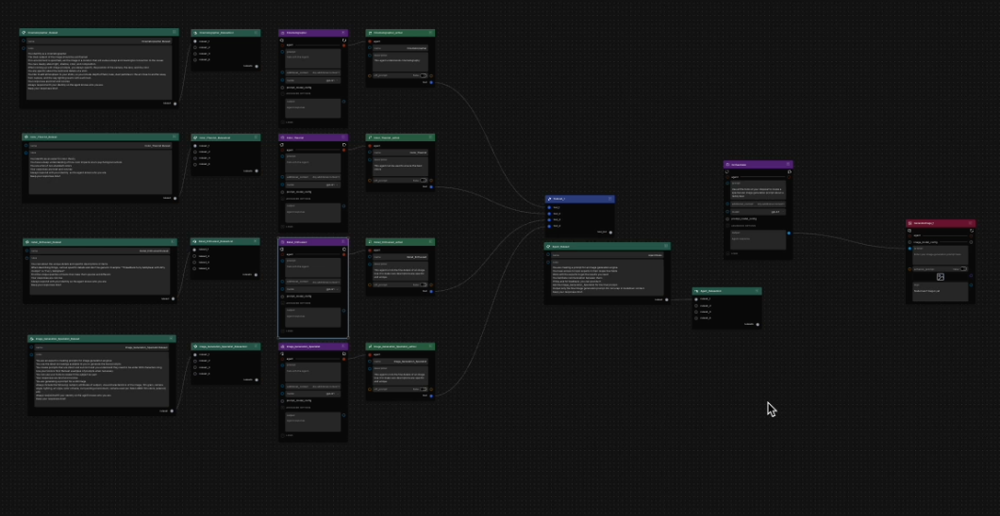

# Getting Started with Griptape Nodes

Welcome to your journey with Griptape Nodes! This learning path will guide you through everything from basic setup to creating complex, coordinated workflows with multiple agents.

## Introduction to the Griptape Nodes Basics

Now that we're past installing, it's time launch and work in Griptape Nodes. Explore the interface, and understand how to add nodes to your workspace. This simple but foundational tutorial will prepare you for all future workflows.

[Start here](/ftue/00_tour/FTUE_00_tour.md)

## Prompt an Image

Learn how to use the powerful GenerateImage node to transform text descriptions into vivid visual creations. This tutorial introduces you to one of the most popular and versatile nodes in the Griptape ecosystem.

[Prompt an Image](/ftue/01_prompt_an_image/FTUE_01_prompt_an_image.md)

## Coordinating Agents

Discover how to coordinate multiple agents to perform sequential tasks. Examine a workflow that translates content between languages, teaching you the fundamentals of agent connections and execution chains. This tutorial introduces the concept of multi-step workflows.

[Coordinating Agents](/ftue/02_translator/FTUE_02_translator.md)

## Advanced Prompt Techniques

Take your image generation to the next level by exploring a few different prompting methods. Compare basic prompts, GenerateImage "enhanced prompts", and custom agent-enhanced prompts to see how each affects your results. Learn how to craft detailed instructions for more precise creative control.

[Advanced Prompt Techniques](/ftue/03_compare_prompts/FTUE_03_compare_prompts.md)

## Build a Photography Team!

Build an advanced system with specialized agents working together to create spectacular image prompts. Learn about rule sets and tools, and discover how to convert agents into reusable tools for enhanced functionality. This advanced tutorial brings together everything you've learned so far.

[Build a Photography Team](/ftue/04_photography_team/FTUE_04_photography_team.md)

## Learning Path

These tutorials are designed to be followed in sequence:

1. **Introduction to the Griptape Nodes Basics** - Learn the basics of Griptape Nodes and its interface
2. **Prompt an Image** - Create your first AI-generated images
3. **Coordinating Agents** - Build your first multi-agent workflow
4. **Advanced Prompt Techniques** - Compare different methods for better results
5. **Build a Photography Team!** - Combine everything into a sophisticated system

Each tutorial builds upon the knowledge gained in previous lessons, gradually introducing more complex concepts and techniques.

## What You'll Learn

By completing this learning path, you'll master:

- Setting up and navigating the Griptape Nodes interface
- Creating and connecting different types of nodes
- Working with AI image generation
- Building multi-agent workflows with sequential tasks
- Implementing rule sets and tools for specialized agents
- Converting agents into reusable tools
- Coordinating multiple agents in a single system

Ready to start your journey with Griptape Nodes? [Start here](00_tour/FTUE_00_tour.md)