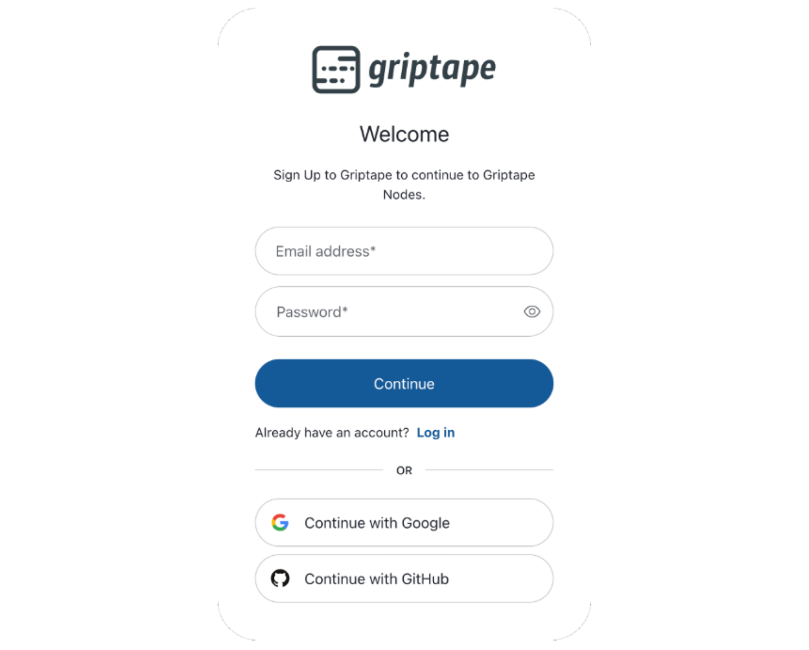

# Getting Started with Griptape\*\*\*[nodes]\*\*\*

An important bit of overview before we begin: Griptape\*\*\*[nodes]\*\*\* is actually two things that work together: An Engine, and a UI. The Engine will install and run on your computer, while the UI is served from the web, and you'll interact with your Engine through a web browser.

> - If you'd rather not install the Engine locally, it is also easy to run it in a hosted environment. The instructions that follow will work the same for either approach.

> - There is no locally-hosted UI option

There are just 4 easy steps:

1. Sign up or Log in
1. Install Your Engine
1. Configuration
1. Start Your Engine

## 1. Sign up or Log in

To get started, visit [https://griptapenodes.com](https://griptapenodes.com) and click the sign-in button.


You'll be presented with a Griptape **Cloud** authorization form.

> If you've already signed up for Griptape **Cloud**, your existing credentials will work here!



Once you've logged in, you'll be presented with a setup screen which walks you through installing the Engine.

## 2. Install Your Engine

Copy the installation command from the **New Installation** section (it's the bit that starts with *curl*) . Open a terminal on your machine and paste and run the command.

> Remember, you can install this on your local machine *or* a cloud-based workstation.

<!--
> * Griptape***[nodes]*** uses **uv**. **uv** is a Python package installer and environment manager.  If you already have it, great!  If not, this process will install it for you.  This is just info - nothing is required on your part either way.
-->


You'll see this message when installation has completed:

```
**************************************
*      Installation complete!        *
*  Run 'griptape-nodes' (or 'gtn')   *
*      to start the engine.          *
**************************************
```

> You'll notice this message gives you two options for commands to run. As previously mentioned, there is no difference between running `griptape-nodes` or `gtn`. They both do the exact same thing.

*After* typing and running `griptape-nodes` or `gtn` in the terminal *for the first time*, you will be asked a series of configuration questions.

## 3. Configuration

**First**, you'll be prompted to set your *workspace directory*. Your workspace directory is where the Griptape\*\*\*[nodes]\*\*\* engine will save \[configuration settings\](reference/glossary.md#Configuration Settings), \[project files\](reference/glossary.md#Project Files), and \[generated assets\](reference/glossary.md#Generated Assets). It will also contain a [.env](reference/glossary.md#.env) for your project \[secret keys\](reference/glossary.md#Secret Keys).

```
╭───────────────────────────────────────────────────────────────────╮
│ Workspace Directory                                               │
│     Select the workspace directory.  This is the location where   │
│     Griptape Nodes will store your saved workflows, configuration │
│     data, and secrets.                                            │
│     You may enter a custom directory or press Return to accept    │
│     the default workspace directory                               │
╰───────────────────────────────────────────────────────────────────╯

Workspace Directory (/Users/user/Documents/local-dev/nodes-test-eng/GriptapeNodes)
```

Pressing Enter will use the default: `working directory/GriptapeNodes`. Alternatively, you can set another location.

> You can always return to this dialog using the `gtn init` command if you need to make changes in the future.

**Second**, you'll be prompted for your Griptape Cloud API Key. Return to the web browser and click the *Generate API Key* button. Copy that key and enter it in the next step.


```
Workspace directory set to: /Users/user/Documents/local-dev/nodes-test-eng/GriptapeNodes
╭─────────────────────────────────────────────────────────────────────────────────────────────────────────────────────────╮
│ Griptape API Key                                                                                                        │
│         A Griptape API Key is needed to proceed.                                                                        │
│         This key allows the Griptape Nodes engine to communicate with the Griptape Nodes Editor.                        │
│         In order to get a key, visit https://nodes.griptape.ai in your browser and click the button "Generate API Key". │
│         Once the key is created, copy and paste its value here to proceed.                                              │
╰─────────────────────────────────────────────────────────────────────────────────────────────────────────────────────────╯
Griptape API Key (YOUR-KEY-HERE):
```

> If you've previously run `gtn init` your key might be presented to you in this dialog. You can accept it by pressing Enter or use a different value as required.

## 4. Start Your Engine

You're ready to proceed. Run either `griptape-nodes` or `gtn` and refresh your browser. You should be taken to an Untitled flow in Griptape\*\*\*[nodes]\*\*\*!.

![A Blank Griptape[nodes] editor](assets/img/getting_started/getting_started-blank_editor.png)
