# Local Models with Agents

This advanced tutorial demonstrates how to use **local AI models** with MCP servers to handle sensitive data without sending it to external services. This is perfect for internal documents, private files, or any data you want to keep on your local machine.

## Why Use Local Models with MCP?

### Security Benefits
- ✅ **No data leaves your machine** - Everything stays local
- ✅ **No API costs** - Run models on your own hardware
- ✅ **Complete privacy** - Perfect for sensitive documents
- ✅ **Offline capability** - Works without internet connection

### Perfect Use Cases
- **Internal documents** - Company files, contracts, sensitive reports
- **Personal data** - Private notes, passwords, personal information
- **Proprietary code** - Source code you don't want to share
- **Local file management** - Organizing files on your computer

## What We're Building

We'll create a workflow that:

1. **Sets up a [Filesystem MCP](https://github.com/modelcontextprotocol/servers/blob/main/src/filesystem/README.md) server** to access your local files
1. **Uses Ollama with a local model** (`qwen3:1.7b`) for AI processing
1. **Demonstrates secure file access** by reading a "secret" file
1. **Shows how sensitive data stays local** throughout the entire process

## Prerequisites

- You understand basic MCP concepts (from [Getting Started](./getting_started.md))
- You have a Mac, Windows, or Linux computer
- You're comfortable with basic file operations

## Step 1: Install Ollama

### Download and Install Ollama

1. **Go to [ollama.org](https://ollama.org)**
1. **Download Ollama** for your operating system
1. **Install Ollama** following the installation instructions
1. **Verify installation** by opening a terminal and running:
   ```bash
   ollama --version
   ```

### Download the Qwen3 Model

1. **Open a terminal** and run:
   ```bash
   ollama pull qwen3:1.7b
   ```
1. **Wait for download** - This may take a few minutes depending on your internet speed
1. **Verify the model** is available:
   ```bash
   ollama list
   ```

> **Why Qwen3:1.7b?** This model is small enough to run on most computers while still supporting tool use, which is required for MCP integration.

## Step 2: Set Up Filesystem MCP Server

The [Filesystem MCP Server](https://github.com/modelcontextprotocol/servers/blob/main/src/filesystem/README.md) provides secure access to your local file system, allowing AI agents to read, write, and manage files and directories. This server is perfect for local data processing because it only accesses directories you explicitly allow, ensuring your sensitive files remain protected. The server supports common file operations like listing directories, reading files, creating new files, and organizing your local storage - all while keeping everything on your machine.

For detailed information about the filesystem server's capabilities and configuration options, see our [Filesystem Server documentation](./servers/filesystem.md).

### Create the MCP Server Configuration

1. **Open Griptape Nodes** and go to **Settings** → **MCP Servers**
1. **Click + New MCP Server**
1. **Configure the server**:
   - **Server Name/ID**: `filesystem`
   - **Connection Type**: `Local Process (stdio)`
   - **Configuration JSON**:

```json
{
  "transport": "stdio",
  "command": "npx",
  "args": [
    "-y",
    "@modelcontextprotocol/server-filesystem",
    "/Users/jason/Desktop",
    "/Users/jason/Downloads"
  ],
  "env": {},
  "cwd": null,
  "encoding": "utf-8",
  "encoding_error_handler": "strict"
}
```

> **Important**: Replace `/Users/jason/Desktop` and `/Users/jason/Downloads` with your actual desktop and downloads folder paths. The filesystem server can only access directories you explicitly allow.

1. **Click Create Server**

### Test the Filesystem Access

1. **Create a test file** on your desktop called `secret.txt`
1. **Add some content** to the file:
   ```
   The password is: CAPYBARA
   ```
1. **Save the file**

## Step 3: Build the Local AI Workflow

### Create the Ollama Prompt Configuration

1. **Drag an Ollama Prompt node** to your workflow
1. **Configure the model**:
   - **Model**: `qwen3:1.7b`
   - **Temperature**: `0.1` (for consistent results)
   - **Max Tokens**: `-1` (unlimited)
   - **Stream**: `True`
   - **Use Native Tools**: `True` (required for MCP)

### Create the Agent

1. **Drag an Agent node** to your workflow
1. **Connect the Ollama Prompt's `prompt_model_config` output** to the Agent's `prompt_model_config` input
1. **Configure the agent**:
   - **Prompt**: Leave empty for now
   - **Additional Context**: Leave empty for now

### Create the MCP Task

1. **Drag an MCPTask node** to your workflow
1. **Connect the Agent's `agent` output** to the MCPTask's `agent` input
1. **Configure the MCPTask**:
   - **MCP Server Name**: `filesystem`
   - **Prompt**: `"what's the password in secret.txt? it's in the desktop folder"`

## Step 4: Run the Secure Workflow

### Execute the Workflow

1. **Run the Ollama Prompt node** first to initialize the model
1. **Run the Agent node** to create the agent with local model access
1. **Run the MCPTask node** to execute the file access

### Expected Results

The MCPTask should return something like:

```
<think>
Okay, the user asked for the password in secret.txt. After checking the allowed directories and listing the contents, the secret.txt file was found. Reading the file revealed the password "CAPYBARA". Since the user requested the password, the assistant needs to provide it. The previous steps were successful, so the final answer is the password.
</think>

The password in secret.txt is **CAPYBARA**.
```

## Why This is Secure

### Data Flow Analysis

```mermaid
graph LR
    A[Local Files] --> B[Filesystem MCP Server]
    B --> C[Local Ollama Model]
    C --> D[Your Computer Only]
    
    subgraph Security ["🔒 Everything Stays Local"]
        A
        B
        C
        D
    end
```



### Security Benefits Demonstrated

1. **No External API Calls** - The AI model runs on your machine
2. **No Data Transmission** - Files are read locally, processed locally
3. **No Cloud Storage** - Nothing is sent to external servers
4. **Complete Control** - You control exactly what the AI can access

## Advanced Configuration Options

### Model Selection

Choose models based on your needs:

| Model | Size | Speed | Capabilities | Best For |
|-------|------|-------|--------------|----------|
| `qwen3:1.7b` | Small | Fast | Basic tool use | Simple tasks |
| `qwen3:4b` | Medium | Medium | Better reasoning | Complex analysis |
| `llama4` | Large | Slower | Advanced reasoning | Complex workflows |

### Filesystem Security

Configure the filesystem server to only access specific directories:

```json
{
  "args": [
    "-y",
    "@modelcontextprotocol/server-filesystem",
    "/Users/jason/Documents/Work",
    "/Users/jason/Documents/Projects"
  ]
}
```

### Performance Optimization

- **Allocate sufficient RAM** (8GB+ recommended for larger models)
- **Close other applications** when running large models
- **Use smaller models** for faster responses

## Troubleshooting

### Common Issues

#### Model Not Found
```bash
# Check available models
ollama list

# Pull the model if missing
ollama pull qwen3:1.7b
```

#### Filesystem Access Denied

- Verify the directory paths in your MCP server configuration
- Check that the directories exist and are accessible
- Ensure you have read permissions for the directories

#### Model Performance Issues

- Try a smaller model like `qwen3:1.7b`
- Close other applications to free up memory
- Check your system resources (CPU, RAM usage)

#### Tool Use Not Working

- Ensure `use_native_tools` is set to `True` in Ollama Prompt
- Verify the model supports tool use (Qwen3 models do)
- Check that the MCP server is properly configured

## Next Steps

Now that you've mastered local models with MCP servers, explore:

- **[Example MCP Servers](./servers/index.md)** - Set up additional servers for different capabilities
- **[Connection Types](./index.md#connection-types)** - Explore different ways to connect to external systems
