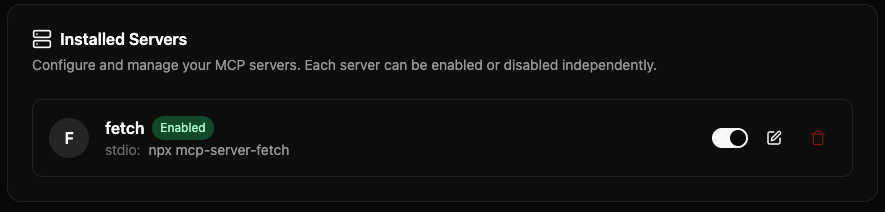

# Getting Started with MCP: Fetch Server Tutorial

This tutorial will walk you through setting up your first MCP server using the **[Fetch MCP Server](https://github.com/modelcontextprotocol/servers/tree/main/src/fetch)** - a simple web content fetching tool that's perfect for beginners.

## What We're Going to Build

We'll set up the [Fetch MCP Server](https://github.com/modelcontextprotocol/servers/tree/main/src/fetch), which provides web content fetching capabilities. This server enables your AI agents to retrieve and process content from web pages, converting HTML to markdown for easier consumption.

**Why Fetch?**

- ✅ **Easy to set up** - Uses `uvx` for automatic installation
- ✅ **No complex dependencies** - Just needs internet access
- ✅ **Immediate results** - You can test it right away
- ✅ **Real-world useful** - Perfect for research and content analysis

## How MCP Works in Griptape Nodes


The MCPTask node acts as a bridge between your Griptape Nodes workflow and external MCP servers, enabling your AI agents to interact with external systems seamlessly.

## Step-by-Step Tutorial

### Step 1: Open MCP Server Settings

1. Open Griptape Nodes

1. Go to **Settings** → **MCP Servers**

    

1. If this is your first time opening the MCP Server Settings, you won't have any MCP servers configured yet.

    

### Step 2: Creating an MCP Server

To create a new MCP Server you'll need to configure the appropriate MCP Server settings.

1. Click **+ New MCP Server**

    

1. Set the **Server Name/ID** to `fetch`

1. Set the **Connection Type** to `Local Process (stdio)` if it's not already set.

1. Look at the **Configuration (JSON)**. It will look something like:

    ```json
    {
        "transport": "stdio",
        "command": "",
        "args": [],
        "env": {},
        "encoding": "utf-8",
        "encoding_error_handler": "strict"
    }
    ```

    This is the information you'll need to fill out that tells the _Client_ (Griptape Nodes) how to connect to the _Server_.

    Most MCP Server documentation will provide instructions on how to set something up for Claude or VS Code. The Fetch server is no different, we'll adapt it's instructions for our use.

1. Navigate to the [Fetch](https://github.com/modelcontextprotocol/servers/tree/main/src/fetch) MCP Server GitHub page

1. Scroll down until you see the [Configuration](https://github.com/modelcontextprotocol/servers/tree/main/src/fetch#configuration) section

1. In the **Configure for Claude.app** section, you'll see "Using `uvx`". Open this and take a look at the instructions:

    ```json
    {
        "mcpServers": {
            "fetch": {
            "command": "uvx",
            "args": ["mcp-server-fetch"]
            }
        }
    }
    ```

    The parts we are interested in are the `command` and the `args`. This is what we'll use in our server.

1. Modify the **Configuration (JSON)** to look like:

    ```json
    {
        "transport": "stdio",
        "command": "uvx",
        "args": ["mcp-server-fetch"],
        "env": {},
        "encoding": "utf-8",
        "encoding_error_handler": "strict"
    }
    ```

    Notice we just modified the **command** and **args** settings to match what was in the docs.

    **Optional: Add Custom Rules**

    You can optionally add custom rules in the **Rules** text area to provide instructions for the AI agent when using this MCP server. These rules are automatically applied when the agent uses tools from this server.

    For example, you might enter:

    ```
    Always validate URLs before fetching. Return errors in JSON format if a fetch fails.
    ```

    Rules help guide the agent's behavior when interacting with this specific MCP server, ensuring consistent and appropriate usage.

1. Click **Create Server**

    

### Step 3: Manage Your Server

Once created, you can see your server in the list. You can:

- **Enable/Disable** servers using the toggle button
- **Edit** a server by clicking the Edit button (you can add or modify rules here)
- **Delete** servers using the delete button

Close the settings when you're done.

### Step 4: Create an MCP Task

1. In your workflow editor, drag an **MCP Task** node from the **Agent** section

    

1. In the MCP Task node, select `fetch` from the **mcp_server_name** dropdown

    

1. If the server isn't showing up, click the **reload button** to refresh the list

### Step 5: Test Your Setup

In the prompt field, ask a question about something from the internet. For example:

```
Explain MCP: https://www.anthropic.com/news/model-context-protocol
```


Then hit the **Run** button on the node.

### Step 6: See the Results

The node will execute and return results like:


## Next Steps: Chaining Tasks

Now that you have a working MCP server, you can:

### Chain Multiple Tasks

- Connect another **MCP Task** node to your first one
- The second task can ask for more information and will use the MCP server if needed
- You can use different MCP servers in each task if required


Notice in the second task, we're asking the agent about the official MCP site, but we don't _specifically_ mention the actual url. That's because in the previous response the MCP server responded with it. The Agent remembers the conversation, and is able to iterate on it.

## What's Next?

Now that you've successfully set up your first MCP server, explore:

- **[Using MCPTask with Agents](./mcp_task_agents.md)** - Advanced integration patterns
- **[Example MCP Servers](./servers/index.md)** - Setup guides for other useful servers
- **[Connection Types](./index.md#connection-types)** - Learn about different ways to connect to apps
