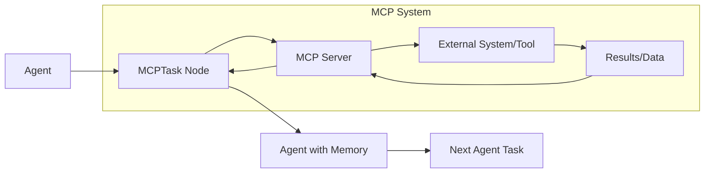
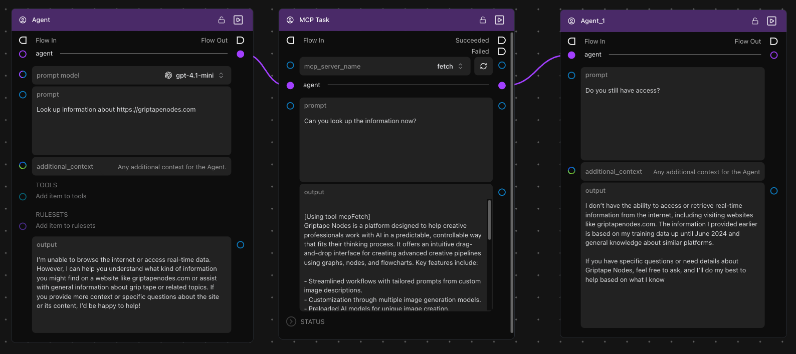

# Using MCPTask with Agents

The **MCPTask** node allows you to give your AI agents temporary access to external tools and data sources. This powerful feature lets you control exactly when and how your agents can interact with external systems.

## Key Concept: Temporary Access with Memory

When you connect an agent to an MCPTask node:

- ✅ **The agent gains access** to the MCP server's tools
- ✅ **The agent can perform tasks** it couldn't do before
- ✅ **The agent retains memory** of what it learned
- ❌ **The agent loses access** to MCP tools after the task

This gives you precise control over when agents can use external capabilities while preserving their learning.

## How MCPTask Works with Agents

The MCPTask node acts as a bridge that temporarily extends your agent's capabilities, then returns an agent with the knowledge gained but without the external access.

## Step-by-Step Demonstration: Temporary Access with Memory

Let's build a workflow that demonstrates how agents temporarily gain MCP capabilities and retain memory. We'll use the Fetch MCP server to show how an agent can access the internet, then continue working with that knowledge.

### Prerequisites

- You have the **Fetch MCP server** set up (from the [Getting Started tutorial](./getting_started.md))
- You understand basic Griptape Nodes workflow concepts

### Step 1: Create Your First Agent

1. **Drag an Agent node** to your workflow editor

1. **Configure the agent**:

    - Set **prompt model** to `gpt-4o-mini` (or your preferred model)
    - Set **prompt** to: `"Look up information about https://griptapenodes.com"`
    - Leave **additional_context** empty for now

1. **Run the agent** - Notice it will respond that it cannot access the internet:

    > I'm unable to browse the internet or access real-time data. However, I can help you understand what kind of information you might find on a website like griptapenodes.com...

This demonstrates the agent's limitations without MCP access.

### Step 2: Add MCPTask Node

1. **Drag an MCPTask node** to your workflow

1. **Connect the Agent output** to the MCPTask node's **agent** input

1. **Configure the MCPTask**:

    - Set **mcp_server_name** to `fetch`
    - Set **prompt** to: `"Can you look up the information now?"`

1. **Run the MCPTask** - The agent now has access to the Fetch server and can retrieve information:

    > [Using tool mcpFetch] Griptape Nodes is a platform designed to help creative professionals work with AI in a predictable, controllable way that fits their thinking process. It offers an intuitive drag-and-drop interface for creating advanced creative pipelines using graphs, nodes, and flowcharts...

### Step 3: Connect to Another Agent

1. **Drag another Agent node** to your workflow

1. **Connect the MCPTask's agent output** to the new Agent's **agent** input

1. **Configure the second agent**:

    - Set **prompt** to: `"Do you still have access?"`

1. **Run the second agent** - Notice it responds:

    > I don't have the ability to access or retrieve real-time information from the internet... The information I provided earlier is based on my training data...

**Key observation**: The agent no longer has MCP access, but it remembers the information it learned during the MCPTask!

### Step 4: Test Memory Retention

1. **Add another Agent node** connected to the previous one

1. **Configure it** with: `"What did you learn about Griptape Nodes?"`

1. **Run it** - The agent will recall the information it learned:

    > Based on the information I learned earlier, Griptape Nodes is a platform designed to help creative professionals work with AI in a predictable, controllable way...

This demonstrates that the agent retains knowledge even after losing MCP access.

## Advanced Agent Configuration

### Customizing Agent Behavior

You can enhance your agents with additional capabilities:

#### Rulesets

Add rulesets to control how your agent behaves:

- **Research Agent**: "Always cite sources when providing information"
- **Creative Agent**: "Think outside the box and suggest innovative solutions"
- **Analytical Agent**: "Provide detailed analysis with pros and cons"

#### Tools

Add additional tools to complement MCP capabilities:

- **Calculator tools** for mathematical operations
- **Date Time** for understanding dates

#### Prompt Models

Choose different models for different tasks:

- **gpt-4o-mini**: Fast and cost-effective for simple tasks
- **gpt-4o**: More capable for complex reasoning
- **Claude Sonnet**: Excellent for analysis and writing

## Next Steps

Now that you understand how agents work with MCPTask nodes, explore:

- **[Local Models with Agents](./advanced_local_models.md)** - Use local AI models for sensitive data processing
- **[Example MCP Servers](./servers/index.md)** - Set up additional servers for different capabilities
- **[Connection Types](./index.md#connection-types)** - Learn about different ways to connect to external systems
