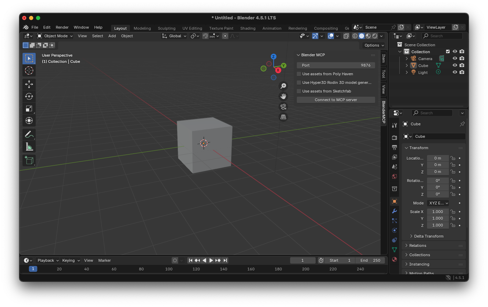

# Blender MCP Server

The **[Blender MCP Server](https://github.com/ahujasid/blender-mcp)** enables AI agents to directly interact with and control Blender. This integration allows for prompt-assisted 3D modeling, scene creation, and manipulation. This is a third-party server created by [Siddharth Ahuja](https://github.com/ahujasid), and is not made by Blender or Griptape.

!!! note "Prerequisites"
    Before using the Blender MCP server, you must:
    
    1. Have Blender 3.0 or newer installed
    2. Install the `uv` package manager ([installation instructions](https://docs.astral.sh/uv/getting-started/installation/))
    3. Download and install the Blender addon from the [repository](https://github.com/ahujasid/blender-mcp)

## Installing the Blender Addon

1. Download the `addon.py` file from the [Blender MCP repository](https://github.com/ahujasid/blender-mcp)
2. Open Blender
3. Go to **Edit** → **Preferences** → **Add-ons**
4. Click **Install...** and select the `addon.py` file
5. Enable the addon by checking the box next to "Interface: Blender MCP"

## Starting the Blender Connection

1. In Blender, open the 3D View sidebar (press **N** if not visible)
2. Find the **BlenderMCP** tab
3. (Optional) Turn on the **Poly Haven** checkbox if you want to use assets from their API
4. Click **Connect to Claude**



## Installation

1. **Open Griptape Nodes** and go to **Settings** → **MCP Servers**

1. **Click + New MCP Server**

1. **Configure the server**:

    - **Server Name/ID**: `blender`
    - **Connection Type**: `Local Process (stdio)`
    - **Configuration JSON**:

    ```json
    {
      "transport": "stdio",
      "command": "uvx",
      "args": [
        "blender-mcp"
      ],
      "env": {
        "BLENDER_PATH": "/usr/bin/blender"
      },
      "cwd": null,
      "encoding": "utf-8",
      "encoding_error_handler": "strict"
    }
    ```

1. **Click Create Server**

!!! warning "Blender Path Varies by System"
    The `BLENDER_PATH` environment variable should point to your Blender executable. Common locations include:
    
    - **macOS**: `/Applications/Blender.app/Contents/MacOS/Blender`
    - **Linux**: `/usr/bin/blender` or `/usr/local/bin/blender`
    - **Windows**: `C:\Program Files\Blender Foundation\Blender\blender.exe`
    
    Your installation path may vary depending on how you installed Blender.

## Available Tools

- **`get_scene_info`** - Get detailed information about the current Blender scene
- **`get_object_info`** - Get information about a specific object in the scene
- **`get_viewport_screenshot`** - Capture a screenshot of the current 3D viewport
- **`execute_blender_code`** - Execute arbitrary Python code in Blender
- **`get_polyhaven_categories`** - Get available asset categories from Poly Haven (requires Poly Haven enabled)
- **`search_polyhaven_assets`** - Search for assets on Poly Haven (requires Poly Haven enabled)
- **`download_polyhaven_asset`** - Download and import Poly Haven assets (requires Poly Haven enabled)
- **`set_texture`** - Apply a downloaded Poly Haven texture to an object (requires Poly Haven enabled)
- **`get_polyhaven_status`** - Check if Poly Haven integration is enabled
- **`get_hyper3d_status`** - Check if Hyper3D Rodin integration is enabled
- **`search_sketchfab_models`** - Search for models on Sketchfab
- **`download_sketchfab_model`** - Download and import Sketchfab models
- **`generate_hyper3d_model_via_text`** - Generate 3D models from text descriptions using Hyper3D Rodin
- **`generate_hyper3d_model_via_images`** - Generate 3D models from images using Hyper3D Rodin
- **`poll_rodin_job_status`** - Check the status of a Hyper3D Rodin generation task
- **`import_generated_asset`** - Import a generated Hyper3D Rodin asset into Blender

## Configuration Options

You can configure additional environment variables to customize the Blender connection:

```json
{
  "transport": "stdio",
  "command": "uvx",
  "args": [
    "blender-mcp"
  ],
  "env": {
    "BLENDER_PATH": "/Applications/Blender.app/Contents/MacOS/Blender",
    "BLENDER_HOST": "localhost",
    "BLENDER_PORT": "9876"
  },
  "cwd": null,
  "encoding": "utf-8",
  "encoding_error_handler": "strict"
}
```

Available environment variables:

- **`BLENDER_PATH`** - Path to your Blender executable
- **`BLENDER_HOST`** - Host address for Blender socket server (default: `localhost`)
- **`BLENDER_PORT`** - Port number for Blender socket server (default: `9876`)

## Advanced Features

### Poly Haven Integration

The Blender MCP server can download and import assets (HDRIs, textures, models) from Poly Haven's free library:

1. Enable Poly Haven in the Blender addon by checking the **Poly Haven** checkbox
2. Use tools like `search_polyhaven_assets` and `download_polyhaven_asset` to find and import assets

Example commands:
- "Download a beach HDRI from Poly Haven and use it as the environment"
- "Find a wood texture on Poly Haven and apply it to this cube"

### Hyper3D Rodin Integration

Generate 3D models using AI through Hyper3D Rodin:

1. Check the Hyper3D status with `get_hyper3d_status`
2. Generate models from text descriptions or images
3. Poll for completion and import the generated asset

!!! info "Hyper3D Free Trial"
    Hyper3D's free trial key allows a limited number of model generations per day. For unlimited access, obtain your own key from [hyper3d.ai](https://hyper3d.ai) and [fal.ai](https://fal.ai).

### Sketchfab Integration

Search and download models from Sketchfab's library:

1. Use `search_sketchfab_models` to find models
2. Download models with `download_sketchfab_model`

## Example Use Cases

Here are some examples of what you can create with the Blender MCP server:

- "Create a low poly scene in a dungeon, with a dragon guarding a pot of gold"
- "Create a beach vibe using HDRIs, textures, and models like rocks and vegetation from Poly Haven"
- "Generate a 3D model of a garden gnome through Hyper3D"
- "Make this car red and metallic"
- "Create a sphere and place it above the cube"
- "Make the lighting like a studio"
- "Point the camera at the scene, and make it isometric"
- "Get information about the current scene and export it as JSON"

## Troubleshooting

### Common Issues

- **Connection Issues**: Ensure the Blender addon server is running (check that you clicked "Connect to Claude" in Blender), verify the MCP server is configured correctly in Griptape Nodes, check that the `BLENDER_PATH` environment variable points to the correct Blender executable
- **First Command Fails**: The first command after connecting sometimes doesn't go through, but subsequent commands typically work. Try running the command again.
- **Timeout Errors**: Try simplifying your requests or breaking them into smaller steps, complex operations may need to be executed in multiple steps
- **Poly Haven Not Working**: Ensure the Poly Haven checkbox is enabled in the Blender addon, verify you have an internet connection, note that Claude can be erratic with Poly Haven integration
- **Code Execution Warnings**: The `execute_blender_code` tool runs arbitrary Python code in Blender, which can be powerful but potentially dangerous. **Always save your work before using it.**

### Debug Tips

1. Check that the Blender addon is enabled and running (look for the BlenderMCP tab in the sidebar)
2. Verify the socket server is active in Blender (status shown in the addon panel)
3. Test with simple commands first (e.g., "get scene information")
4. If Poly Haven or Hyper3D features aren't working, check their status with the respective status tools
5. Restart both Blender and the MCP connection if issues persist

## Resources

- [Blender MCP Server Repository](https://github.com/ahujasid/blender-mcp) - Official repository and documentation
- [Blender Python API](https://docs.blender.org/api/current/) - Reference for Blender scripting
- [Poly Haven](https://polyhaven.com/) - Free 3D assets library
- [Hyper3D Rodin](https://hyper3d.ai) - AI-powered 3D model generation
- [Sketchfab](https://sketchfab.com/) - 3D model marketplace

## Security Considerations

!!! danger "Arbitrary Code Execution"
    The `execute_blender_code` tool allows running arbitrary Python code in Blender. This can be powerful but potentially dangerous:
    
    - **Always save your Blender work** before using code execution
    - Review generated code when possible
    - Use with caution in production environments
    - Be aware that malicious code could potentially harm your system or data

!!! info "Asset Downloads"
    Poly Haven and Sketchfab integrations require downloading external assets:
    
    - Downloads may be large (textures, HDRIs, models)
    - Ensure you have adequate disk space
    - Assets are stored in Blender's cache directory
    - If you don't want to use these features, keep Poly Haven disabled in the addon

