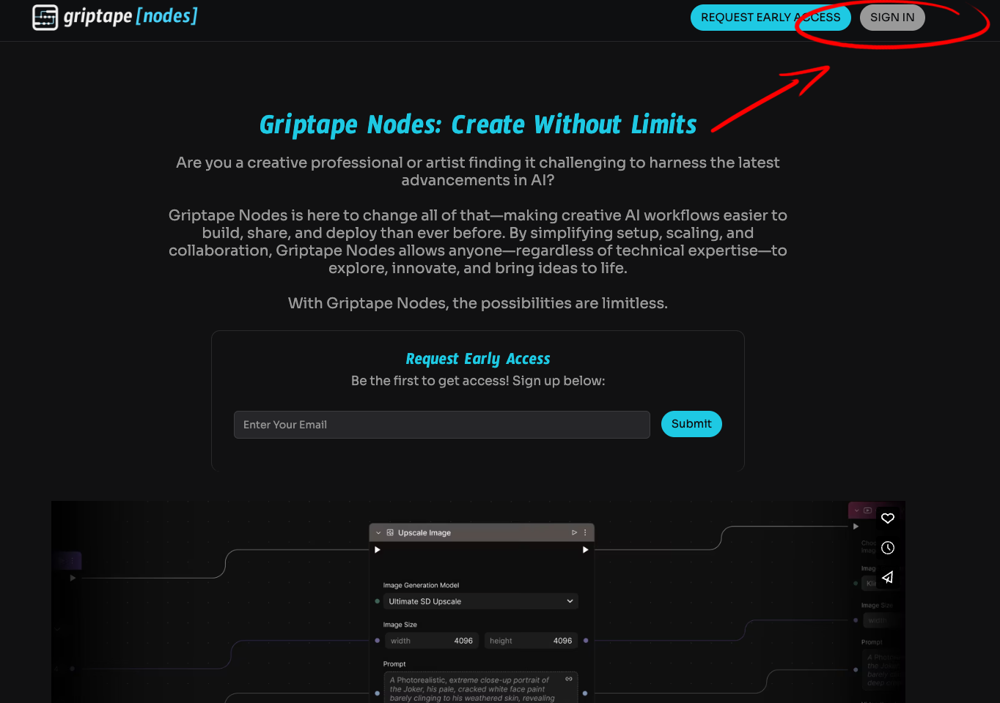
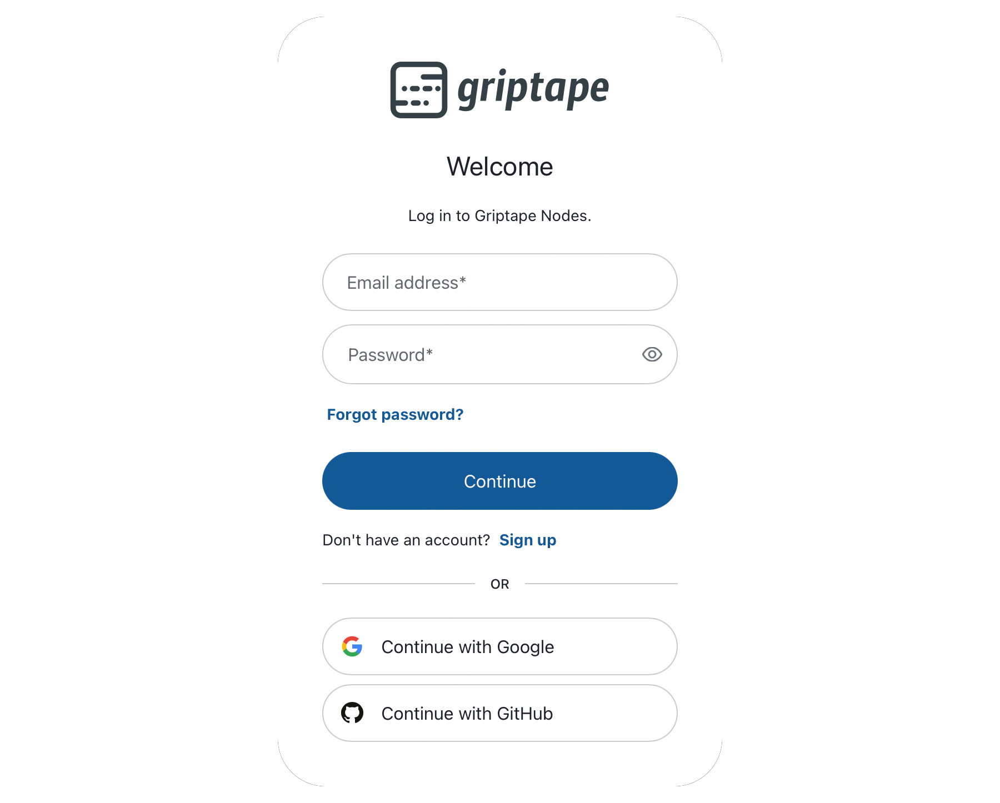
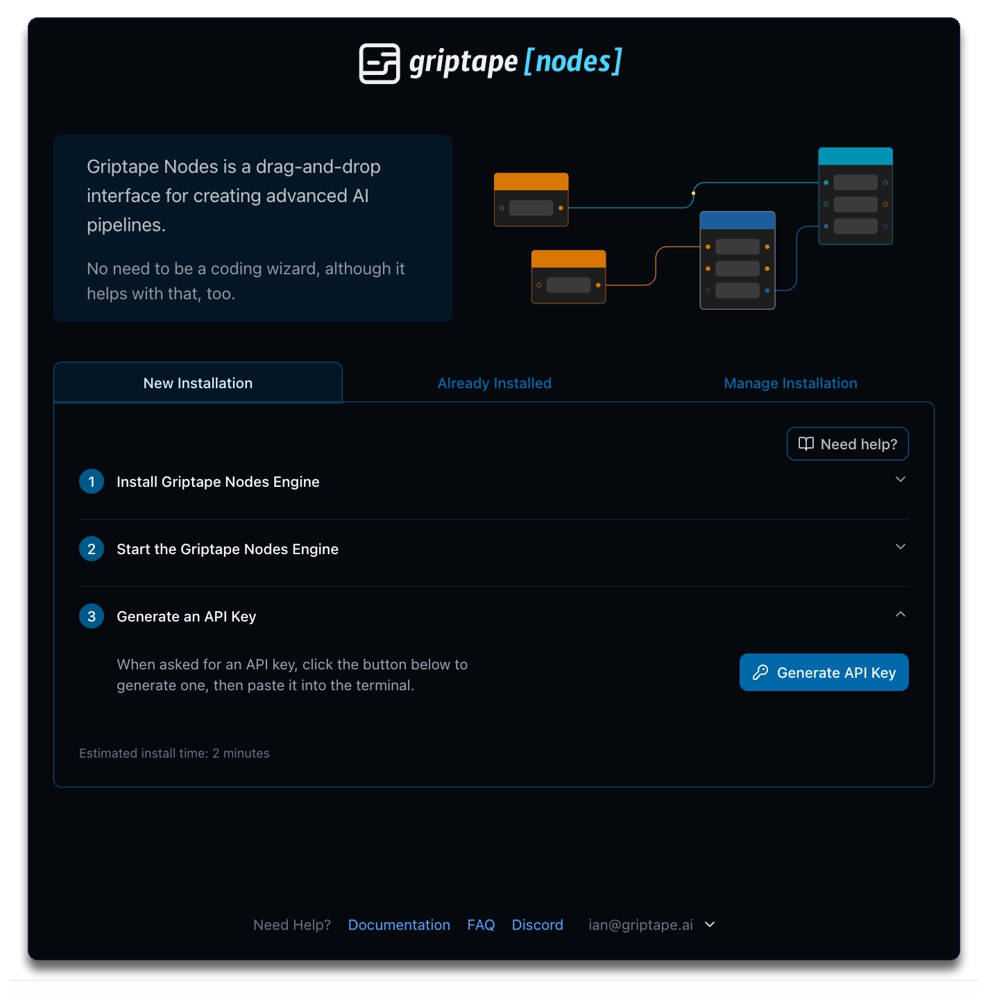
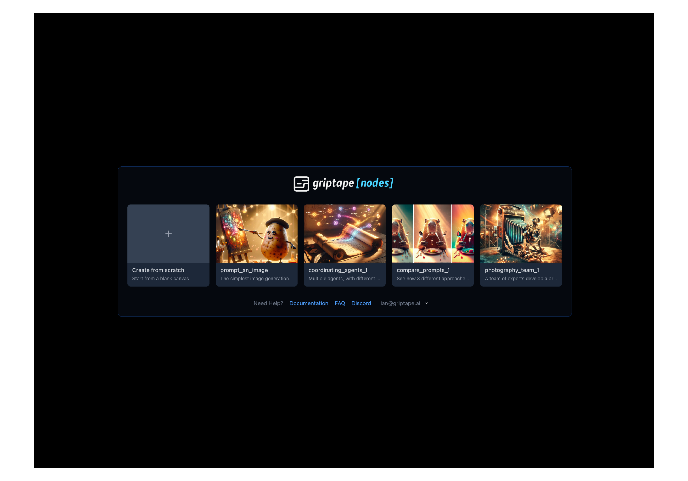

# Installing Griptape Nodes

Griptape Nodes is comprised of two components - an Editor and an Engine. The Editor is served from the web, so there is no need to install that, and you'll interact with your Engine through the Editor in your web browser.

The Engine can be installed on your local machine, whether that runs MacOS, Windows or Linux.

If you'd rather not install the Engine locally, perhaps because you want it to be able to access more resources than you have available on your laptop, it is easy to run it in on a separate machine. The instructions that follow will work the same for either approach.

The Editor and the Engine are decoupled and communicate with each other through an event service. There is no locally-hosted Editor option

#### Summary

There are just 4 steps required to install Griptape Nodes:

1. Sign up or Log in
1. Install the Griptape Nodes Engine
1. Configuration
1. Start Your Engine

## 1. Sign up or Log in

To get started, visit [https://griptapenodes.com](https://griptapenodes.com) and click the sign-in button.



You'll be presented with a Griptape account authorization form.

> If you've already signed up for [Griptape Cloud](https://cloud.griptape.ai), your existing credentials will work here!



Once you've logged in, you'll be presented with a setup screen which walks you through installing the Engine.

## 2. Install the Griptape Nodes Engine

### Griptape Nodes Desktop (Recommended)

Download [Griptape Nodes Desktop](https://www.griptapenodes.com/griptape-nodes-desktop) — a bundled app that includes both the engine and the editor. No further steps are needed; Desktop handles everything for you.

### Advanced: Manual Engine Install

If you prefer to install the engine yourself:

1. Install [uv](https://docs.astral.sh/uv/getting-started/installation/) if you don't already have it.

1. Run the following command to install the Griptape Nodes Engine:

    ```bash
    uv tool install griptape-nodes
    ```

After installation, run `griptape-nodes` or `gtn` in the terminal *for the first time* and you will be asked a series of configuration questions.

## 3. Configuration

**First**, you'll be prompted to set your *workspace directory*. Your workspace directory is where the Griptape Nodes engine will save [project files](./glossary.md#project-files), and [generated assets](./glossary.md#generated-assets). It will also contain a [.env](./glossary.md#.env) for your Griptape Nodes [secret keys](./glossary.md#secret-keys).

```
╭───────────────────────────────────────────────────────────────────╮
│ Workspace Directory                                               │
│     Select the workspace directory. This is the root for your     │
│     projects, saved workflows, and potentially project-specific   │
│     settings. By default, this will be set to                     │
│     "<current_working_directory>/GriptapeNodes", which is the     │
│     directory from which you run the 'gtn' command.               │
│     You may enter a custom directory or press Return to accept    │
│     the default workspace directory.                              │
╰───────────────────────────────────────────────────────────────────╯
Workspace Directory (/Users/user/Documents/local-dev/nodes-test-eng/GriptapeNodes)
```

Pressing Enter will use the default: `<current_working_directory>/GriptapeNodes`, where `<current_working_directory>` is the directory from which you're running the `gtn` command. Alternatively, you can specify any location you prefer.

> You can always return to this dialog using the `gtn init` command if you need to make changes in the future.

**Second**, you'll be prompted for your Griptape Cloud API Key.

1. Return to the web browser and open **Step 3: Generate an API Key**.

1. Click the *Generate API Key* button.

1. Copy the key that is generated and enter it in the next step. Note that the API key will not be saved.



```
Workspace directory set to: /Users/user/Documents/local-dev/nodes-test-eng/GriptapeNodes
╭─────────────────────────────────────────────────────────────────────────────────────────────────────────────────────────╮
│ Griptape API Key                                                                                                        │
│         A Griptape API Key is needed to proceed.                                                                        │
│         This key allows the Griptape Nodes Engine to communicate with the Griptape Nodes Editor.                        │
│         In order to get your key, return to the https://nodes.griptape.ai tab in your browser and click the button      │
│         "Generate API Key".                                                                                             │
│         Once the key is generated, copy and paste its value here to proceed.                                            │
╰─────────────────────────────────────────────────────────────────────────────────────────────────────────────────────────╯
Griptape API Key (YOUR-KEY-HERE):
```

!!! info

    If you've previously run `gtn init` your key might be presented to you in this dialog. You can accept it by pressing Enter or use a different value as required.

## 4. Start Your Engine

Your installation is now complete and you're ready to proceed to creating your first Workflow or trying out one of the sample workflows. To get started, return to your terminal and run `griptape-nodes` or `gtn`, then return to your browser. Your browser tab at [https://nodes.griptape.ai](https://nodes.griptape.ai) will update to show *Create from scratch*, allowing you to start from a blank canvas, together with several sample Griptape Nodes workflows that you can experiment with!



Next, on to learning how to actually work inside Griptape Nodes! [Begin](ftue/FTUE.md)
