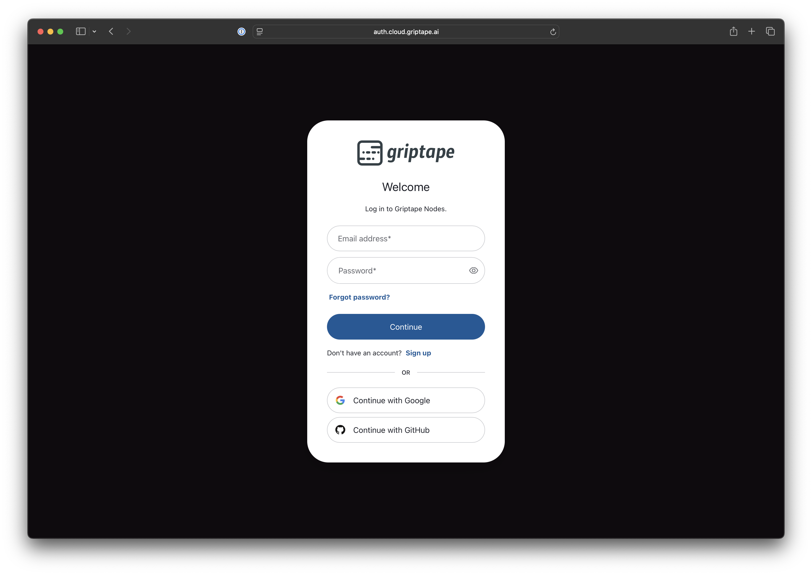
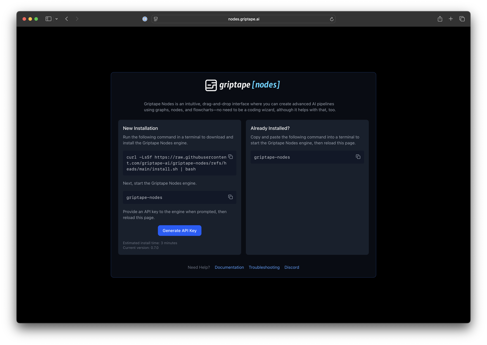
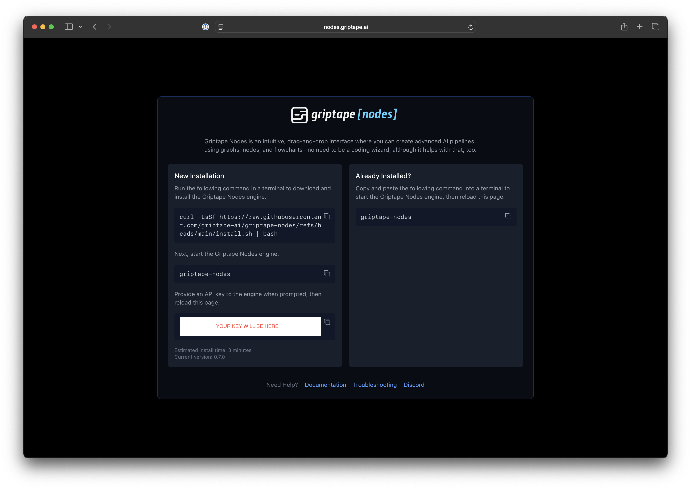
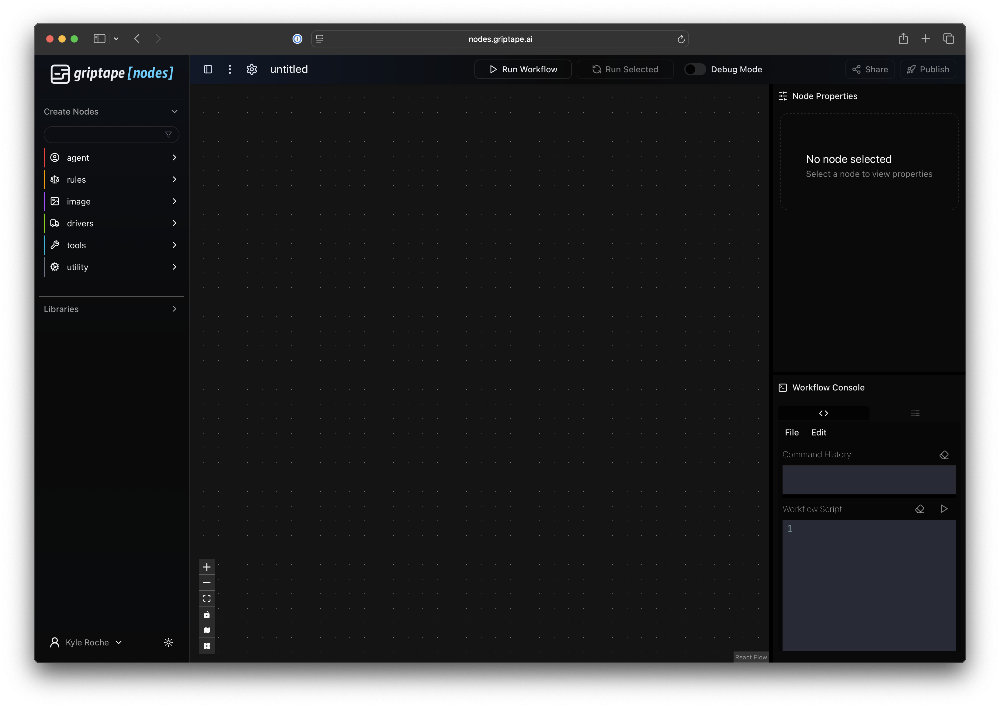

# Setup Griptape Nodes

Griptape Nodes has a cloud-based IDE that works in conjunction with an installable engine. The engine can be installed on your local machine or in a hosted environment. The instructions that follow are the same in either case.

The IDE allows you to create workflows using a node based editor. The workflows are executed in the engine allowing for advanced capabilities like debugging a flow, stepping through a flow node by node, and iterating over parts of a flow. The IDE also exposes scriptable interface to your flows.

## Login

To get started, visit https://griptapenodes.com and click the sign-in button. You'll be presented with a Griptape Cloud authorization form.

> If you've previously logged into Griptape Cloud, or have an account there, use the same credentials.



Once you've logged in, you'll be presented with a setup screen which walks you through the installation process of your engine. Again, you can run this on your local machine or any cloud based workstation.

## Install the Engine

The first step is to install the engine. Copy the installation command from the New Installation section. Open a terminal on your machine and paste and run the command. If you already have `uv` installed, the installation process should be quick. If you need `uv`, we'll install it for you.



You'll see a message similar to the following when installation has completed.

```
**************************************
*      Installation complete!        *
*  Run 'griptape-nodes' (or 'gtn')   *
*      to start the engine.          *
**************************************
```

## Configuration

WHen you start Griptape Nodes using `griptape-nodes` or `gtn` for the first time, it will ask you a series of questions. First, you'll be prompted to set your **workspace directory.** Your workspace directory is where the Griptape Nodes engine will save configuration settings, project files, and generated assets. It will also contain a .env for your project secret key values.

```
╭─────────────────────────────────────────────────────────────────────────────────────────────────────────────────────────────────────╮
│ Workspace Directory                                                                                                                 │
│     Select the workspace directory. This is the location where Griptape Nodes will store your saved workflows, configuration data,  │
│ and secrets.                                                                                                                        │
│     You may enter a custom directory or press Return to accept the default workspace directory                                      │
╰─────────────────────────────────────────────────────────────────────────────────────────────────────────────────────────────────────╯
Workspace Directory (/Users/user/Documents/local-dev/nodes-test-eng/GriptapeNodes):
```

You can accept the default, which will be your present `working directory/GriptapeNodes` by pressing Enter. Or, you can set another location. You can always return to this dialog using the `gtn init` command if you need to make changes in the future.

Next, you'll be prompted for your Griptape Cloud API Key. Return to the web browser and click the **Generate API Key** button. Copy that key and enter it in the next step.



```
Workspace directory set to: /Users/user/Documents/local-dev/nodes-test-eng/GriptapeNodes
╭─────────────────────────────────────────────────────────────────────────────────────────────────────────────────────────╮
│ Griptape API Key                                                                                                        │
│         A Griptape API Key is needed to proceed.                                                                        │
│         This key allows the Griptape Nodes engine to communicate with the Griptape Nodes Editor.                        │
│         In order to get your key, return to the https://nodes.griptape.ai tab in your browser and click the button      │
│         "Generate API Key".                                                                                             │
│         Once the key is generated, copy and paste its value here to proceed.                                            │
╰─────────────────────────────────────────────────────────────────────────────────────────────────────────────────────────╯
Griptape API Key (YOUR-KEY-HERE):
```

> If you've previously run `gtn init` your key might be presented to you in this dialog. You can accept it by pressing Enter or use a different value as required.

## Start your Engine

You're ready to proceed. Run `griptape-nodes` or `gtn` and return to your browser. Your browser tab at https://nodes.griptape.ai will be updated to the IDE.


